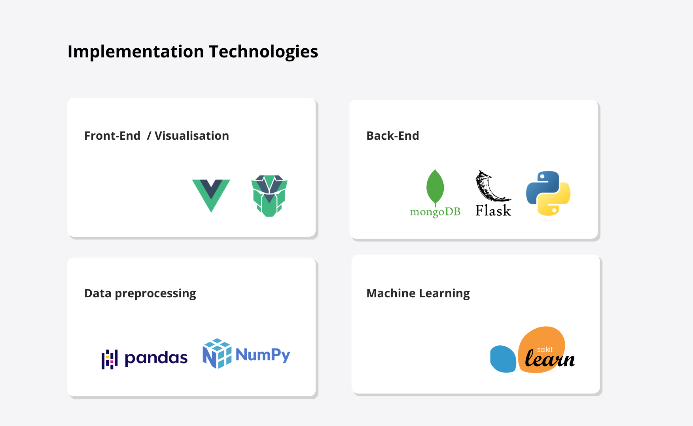

# Student Grade Predictor: An Interactive Learning Analytics Tool

Welcome to the Student Grade Predictor, an application designed to assist students in understanding their academic performance through predictive modeling and data visualization. In this tool, we leverage machine learning to predict student grades based on a variety of factors, utilizing both a personalized approach (based on individual student data) and a non-personalized approach (through general grade trends and attributes). The Student Grade Predictor is developed to be user-friendly and accessible to students across all disciplines.

## Dataset Description

For this project, we have compiled a comprehensive dataset (`Expanded_data_with_more_features.csv`) which includes information about student grades, their demographic details, academic background, and other relevant factors from 2013 to 2014. Key data points include:

- Student demographics (age, gender, region, etc.)
- Course details
- Historical grades
- Attendance records
- Other academic factors

## Data Storage and Retrieval with MongoDB

The application uses MongoDB for efficient data storage and retrieval. Data relevant to student grades, including historical data and predictive analysis results, are stored in a MongoDB database. This approach facilitates:

- Persistent storage of prediction results.
- Efficient retrieval of data for visualization and further analysis in the web application.

## Needed Libraries

To run this project, the following libraries are required:

- Pandas
- Numpy
- Scikit-learn
- Joblib
- Flask
- Vue.js
- Pymongo (for MongoDB integration)

## The Stack

This project employs various technologies and tools:

### Data Preprocessing and Analysis

- Pandas and Numpy for data handling.
- Jupyter Notebooks (`EDA-StudentGrades.ipynb` and `Modelling-StudentGrades.ipynb`) for exploratory data analysis and model development.

### Front-End

- Vue.js for interactive web interface.
- HTML, CSS, and JavaScript for website structure and styling.

### Visualization

- Integrated data visualizations using Vue.js components (`DataViz.vue`).

### Back-End

- Flask web server (`app.py`).
- Database integration with MongoDB for data storage and retrieval (`db_save_data.py`).

### Machine Learning

- A predictive model (`final_model.joblib`) developed using Scikit-learn.

## App Structure

The project is structured as follows:

- **Front-End Components**:
  - `App.vue`
  - `DataViz.vue`
  - `PredictGrade.vue`
- **Back-End Scripts**:
  - `app.py`
  - `db_save_data.py`
- **Machine Learning**:
  - Jupyter Notebooks for model development.
  - `final_model.joblib` for the trained model.
- **Data**:
  - `Expanded_data_with_more_features.csv` for the dataset.

## Machine Learning Pipeline

This project utilizes a machine learning pipeline implemented in Python. The model is trained on historical student data to predict future grades. The process involves data preprocessing, feature engineering, model training, and evaluation. The final model is saved as `final_model.joblib` and is used for grade predictions in the application.

## Visualization

The application includes an interactive data visualization component built with Vue.js. It provides insights into grade distributions, student demographics, and other relevant academic factors.

## Getting Started

To get started with the Student Grade Predictor:

1. Clone the repository.
2. Install the required libraries.
3. Run the Jupyter notebooks for data preprocessing and model training.
4. Start the Flask server for the back-end.
5. Launch the Vue.js application for the front-end.

We hope this tool proves to be a valuable resource for students and educators alike, providing insights into academic performance and aiding in educational planning.
